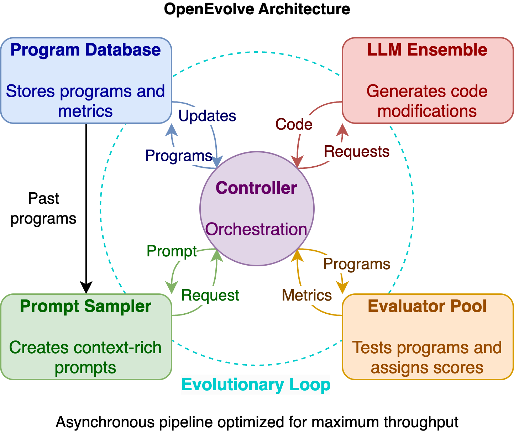

# OpenEvolve: Setting the Stage

Walking into the `openevolve` repository feels like entering a research lab where autonomous coding experiments never sleep. The promise is bold: let large language models evolve code the way nature evolves species, iterating rapidly until something extraordinary emerges. The README sets the tone—autonomous discovery, reproducibility, and real-world speedups—but the real heartbeat lives inside the Python package.



The narrative begins in `openevolve/api.py`, where library users summon the system with `run_evolution`. This entrypoint accepts raw code, file paths, or even callables for evaluation, then quietly constructs the full control stack:

```python
controller = OpenEvolve(
    initial_program_path=program_path,
    evaluation_file=evaluator_path,
    config=config_obj,
    output_dir=actual_output_dir
)

best_program = await controller.run(iterations=iterations)
```

What reads like a simple asynchronous call hides a complex choreography. `OpenEvolve` is more than an orchestrator—it wires together configuration, language models, prompt samplers, evaluators, and a program database that keeps evolutionary history intact. The goal is singular yet multifaceted: discover code that scores higher on the metrics defined by the user-provided evaluator, whether that means faster runtimes, better accuracy, or entirely new algorithms.

This story threads through configurations that define LLM ensembles, prompts that adapt to evolutionary context, and evaluators that double as judges and archivists. Each module tightens the weave of an experiment that should be reproducible, inspectable, and ready to hand over artifacts for further study. With this stage set, the next chapters introduce the cast and the dynamics that make OpenEvolve feel alive.
