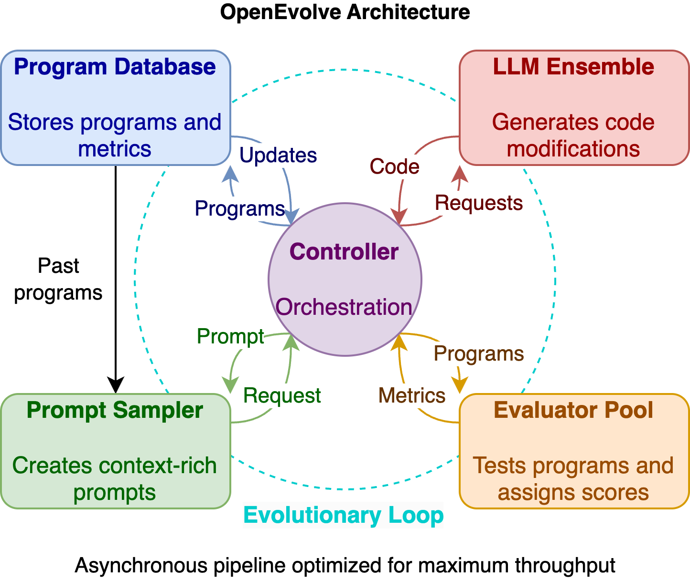

# The Cast and Their Choreography

Once `OpenEvolve` takes the stage, it gathers a troupe of specialized performers. The controller (`openevolve/controller.py`) assembles them during initialization, wiring data flows before the first iteration even begins:



```python
self.llm_ensemble = LLMEnsemble(self.config.llm.models)
self.prompt_sampler = PromptSampler(self.config.prompt)
self.database = ProgramDatabase(self.config.database)
self.evaluator = Evaluator(
    self.config.evaluator,
    evaluation_file,
    self.llm_evaluator_ensemble,
    self.evaluator_prompt_sampler,
    database=self.database,
    suffix=Path(self.initial_program_path).suffix,
)
```

* **LLM Ensemble** – The creative engine. By sampling from weighted models (`openevolve/llm/ensemble.py`), the system mixes deterministic and stochastic energy, often seeding the random state for reproducibility.
* **Prompt Sampler** – The dramaturg who curates context. In `PromptSampler.build_prompt`, it stitches together metrics, prior programs, and optional artifacts to coax the model toward meaningful change.
* **Program Database** – The historian and strategist. The MAP-Elites inspired `ProgramDatabase` balances exploration versus exploitation across islands, ensuring diversity while protecting the best discoveries.
* **Evaluator** – The critic. It dynamically loads an `evaluate` function, spins up temporary files, retries on failure, and records artifacts or cascaded stages before handing back scores.

These components talk continuously. The controller asks the database for a parent and inspirations, hands that context to the prompt sampler, uses the ensemble for a diff or rewrite, and then rushes the candidate to the evaluator. Results flow back into the database, which updates island archives and tracks the all-time best program. The loop is tight, but rich with hooks for tracing, parallelism, and custom scoring.
